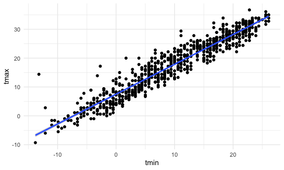

iteration_and_listcols
================
Nicole Criscuolo
2025-10-28

## Make a list

``` r
l = 
  list(
    vec_numeric = 1:23,
    char_vec = c("Nicole"),
    mat = matrix (1:8, nrow = 2, ncol = 4),
    summary = summary(rnorm(1000, mean = 4))
  )

l
```

    ## $vec_numeric
    ##  [1]  1  2  3  4  5  6  7  8  9 10 11 12 13 14 15 16 17 18 19 20 21 22 23
    ## 
    ## $char_vec
    ## [1] "Nicole"
    ## 
    ## $mat
    ##      [,1] [,2] [,3] [,4]
    ## [1,]    1    3    5    7
    ## [2,]    2    4    6    8
    ## 
    ## $summary
    ##    Min. 1st Qu.  Median    Mean 3rd Qu.    Max. 
    ##   1.308   3.334   4.058   4.049   4.698   6.806

``` r
l[[1]]
```

    ##  [1]  1  2  3  4  5  6  7  8  9 10 11 12 13 14 15 16 17 18 19 20 21 22 23

``` r
l[["vec_numeric"]]
```

    ##  [1]  1  2  3  4  5  6  7  8  9 10 11 12 13 14 15 16 17 18 19 20 21 22 23

``` r
l$mat
```

    ##      [,1] [,2] [,3] [,4]
    ## [1,]    1    3    5    7
    ## [2,]    2    4    6    8

## Make a different list.

``` r
list_normals =
  list(
    a = rnorm(30, mean = 3, sd = 1),
    b = rnorm(30, mean = 30, sd = 1),
    c = rnorm(30, mean = 3, sd = 10),
    d = rnorm(30, mean = -3, sd = 4)
  )
```

(copy and paste function from last time)

``` r
mean_and_sd = function(x) {
  
  if (!is.numeric(x)) {
    stop("The input x should be numeric")
  }
  
  if (length(x) < 5) {
    stop("Only compute mean and sd when the input has 5 or more numbers")
  }
  
  mean_x = mean(x, na.rm = TRUE)
  sd_x = sd(x, na.rm = TRUE)
  
  c(mean_x, sd_x)
  
}
```

``` r
mean_and_sd(list_normals[[1]])
```

    ## [1] 3.081810 1.148081

``` r
mean_and_sd(list_normals[[2]])
```

    ## [1] 30.3108812  0.9741613

``` r
mean_and_sd(list_normals[[3]])
```

    ## [1] -0.3104357 12.3526641

``` r
mean_and_sd(list_normals[[4]])
```

    ## [1] -1.419151  3.768292

Use a loop to iterate.

``` r
output = vector("list", length = 4)

for (i in 1:4) {
  output[[i]] = mean_and_sd(list_normals[[i]])
}

output
```

    ## [[1]]
    ## [1] 3.081810 1.148081
    ## 
    ## [[2]]
    ## [1] 30.3108812  0.9741613
    ## 
    ## [[3]]
    ## [1] -0.3104357 12.3526641
    ## 
    ## [[4]]
    ## [1] -1.419151  3.768292

Use `map` to do the same thing.

``` r
output1 = map(list_normals, mean_and_sd)
output1
```

    ## $a
    ## [1] 3.081810 1.148081
    ## 
    ## $b
    ## [1] 30.3108812  0.9741613
    ## 
    ## $c
    ## [1] -0.3104357 12.3526641
    ## 
    ## $d
    ## [1] -1.419151  3.768292

``` r
output2 = map(list_normals, median)
output2
```

    ## $a
    ## [1] 3.028051
    ## 
    ## $b
    ## [1] 30.10163
    ## 
    ## $c
    ## [1] -0.3039897
    ## 
    ## $d
    ## [1] -1.037903

Check out some `map` variants.

``` r
map_dfr(list_normals, mean_and_sd, .id = "sample")
```

    ## # A tibble: 2 × 4
    ##       a      b      c     d
    ##   <dbl>  <dbl>  <dbl> <dbl>
    ## 1  3.08 30.3   -0.310 -1.42
    ## 2  1.15  0.974 12.4    3.77

``` r
map_dbl(list_normals, median)
```

    ##          a          b          c          d 
    ##  3.0280509 30.1016291 -0.3039897 -1.0379031

## List Columns

Try to put a list into a df

``` r
listcol_df =
  tibble(
    name = c("a", "b", "c", "d"),
    sample = list_normals
  )
```

Did this really work?

``` r
pull(listcol_df, name)
```

    ## [1] "a" "b" "c" "d"

``` r
pull(listcol_df, sample)
```

    ## $a
    ##  [1] 1.6978098 2.7046784 4.4443234 0.8470789 2.1243008 6.5430734 5.1445040
    ##  [8] 2.5024239 2.2012394 2.6071501 3.9021253 3.4076528 2.8155210 2.5530296
    ## [15] 3.3159255 1.5028253 1.5069506 2.3584323 4.1560837 3.3177181 3.5939504
    ## [22] 3.0439345 4.0633605 3.1714143 2.4712014 3.7262281 3.4743755 2.5092825
    ## [29] 3.0121672 3.7355299
    ## 
    ## $b
    ##  [1] 29.96301 29.65482 30.52342 29.75295 30.68210 31.71103 30.13799 29.75289
    ##  [9] 31.05537 30.09022 31.90872 31.03065 29.16163 29.54977 28.65520 30.47809
    ## [17] 30.11304 29.64885 30.43103 29.08454 30.39739 31.63700 32.64408 29.72970
    ## [25] 29.55652 29.75024 32.00149 31.33399 29.44737 29.44336
    ## 
    ## $c
    ##  [1]   4.0898699   4.7984094   0.4385237 -15.3202168  -1.0465032  -1.6399245
    ##  [7]   0.4405110   7.5005295 -13.7390732  23.9465591 -10.0424725 -10.2701253
    ## [13]  17.6096918 -15.6114161 -17.0293172 -18.5809965   9.2482142   9.7221742
    ## [19]  -8.1738576  16.8418669  12.9424168   7.0673215  -3.1598186   6.6832139
    ## [25]  23.2260642 -12.9998170  -1.9998951 -19.7557637  -5.4116680   0.9124270
    ## 
    ## $d
    ##  [1]   2.7511595   0.8066277  -4.7178042   0.8610830  -0.3845520   3.3891766
    ##  [7]  -1.9729662  -3.2753356   2.0694021  -1.2196313  -3.6466225   3.2925390
    ## [13]  -4.6113010  -3.4445042  -0.2283381  -5.6426596   5.0403544   2.9085742
    ## [19]  -4.8863102   1.2283040 -12.9576132  -0.8874733  -1.7717409   0.8112208
    ## [25]  -7.3179919  -1.1883330  -1.5178755  -0.7734523   0.2046696  -5.4931214

Can I apply `mean_and_sd`?

``` r
pull(listcol_df, sample)[[1]]
```

    ##  [1] 1.6978098 2.7046784 4.4443234 0.8470789 2.1243008 6.5430734 5.1445040
    ##  [8] 2.5024239 2.2012394 2.6071501 3.9021253 3.4076528 2.8155210 2.5530296
    ## [15] 3.3159255 1.5028253 1.5069506 2.3584323 4.1560837 3.3177181 3.5939504
    ## [22] 3.0439345 4.0633605 3.1714143 2.4712014 3.7262281 3.4743755 2.5092825
    ## [29] 3.0121672 3.7355299

``` r
pull(listcol_df, sample)[[2]]
```

    ##  [1] 29.96301 29.65482 30.52342 29.75295 30.68210 31.71103 30.13799 29.75289
    ##  [9] 31.05537 30.09022 31.90872 31.03065 29.16163 29.54977 28.65520 30.47809
    ## [17] 30.11304 29.64885 30.43103 29.08454 30.39739 31.63700 32.64408 29.72970
    ## [25] 29.55652 29.75024 32.00149 31.33399 29.44737 29.44336

``` r
pull(listcol_df, sample)[[3]]
```

    ##  [1]   4.0898699   4.7984094   0.4385237 -15.3202168  -1.0465032  -1.6399245
    ##  [7]   0.4405110   7.5005295 -13.7390732  23.9465591 -10.0424725 -10.2701253
    ## [13]  17.6096918 -15.6114161 -17.0293172 -18.5809965   9.2482142   9.7221742
    ## [19]  -8.1738576  16.8418669  12.9424168   7.0673215  -3.1598186   6.6832139
    ## [25]  23.2260642 -12.9998170  -1.9998951 -19.7557637  -5.4116680   0.9124270

``` r
pull(listcol_df, sample)[[4]]
```

    ##  [1]   2.7511595   0.8066277  -4.7178042   0.8610830  -0.3845520   3.3891766
    ##  [7]  -1.9729662  -3.2753356   2.0694021  -1.2196313  -3.6466225   3.2925390
    ## [13]  -4.6113010  -3.4445042  -0.2283381  -5.6426596   5.0403544   2.9085742
    ## [19]  -4.8863102   1.2283040 -12.9576132  -0.8874733  -1.7717409   0.8112208
    ## [25]  -7.3179919  -1.1883330  -1.5178755  -0.7734523   0.2046696  -5.4931214

Iterate using `map`

``` r
map(pull(listcol_df, sample), mean_and_sd)
```

    ## $a
    ## [1] 3.081810 1.148081
    ## 
    ## $b
    ## [1] 30.3108812  0.9741613
    ## 
    ## $c
    ## [1] -0.3104357 12.3526641
    ## 
    ## $d
    ## [1] -1.419151  3.768292

Adding a column…

``` r
listcol_df =
listcol_df |> 
  mutate(
    summary = map(sample, mean_and_sd)
  )

pull(listcol_df, summary)
```

    ## $a
    ## [1] 3.081810 1.148081
    ## 
    ## $b
    ## [1] 30.3108812  0.9741613
    ## 
    ## $c
    ## [1] -0.3104357 12.3526641
    ## 
    ## $d
    ## [1] -1.419151  3.768292

``` r
listcol_df |> 
  select(-sample) |> 
  unnest(summary)
```

    ## # A tibble: 8 × 2
    ##   name  summary
    ##   <chr>   <dbl>
    ## 1 a       3.08 
    ## 2 a       1.15 
    ## 3 b      30.3  
    ## 4 b       0.974
    ## 5 c      -0.310
    ## 6 c      12.4  
    ## 7 d      -1.42 
    ## 8 d       3.77

## Revisit NSDUH

``` r
nsduh_url = "http://samhda.s3-us-gov-west-1.amazonaws.com/s3fs-public/field-uploads/2k15StateFiles/NSDUHsaeShortTermCHG2015.htm"

nsduh_html = read_html(nsduh_url)

nsduh_import = function(html, table_num) {
  
  table = 
  html |> 
  html_table() |> 
  nth(table_num) |>
  slice(-1) |> 
  select(-contains("P Value")) |>
  pivot_longer(
    -State,
    names_to = "age_year", 
    values_to = "percent") |>
  separate(age_year, into = c("age", "year"), sep = "\\(") |>
  mutate(
    year = str_replace(year, "\\)", ""),
    percent = str_replace(percent, "[a-c]$", ""),
    percent = as.numeric(percent)) |>
  filter(!(State %in% c("Total U.S.", "Northeast", "Midwest", "South", "West")))
  
  table
  
}

    nsduh_import(nsduh_html, table_num = 1)
```

    ## # A tibble: 510 × 4
    ##    State   age   year      percent
    ##    <chr>   <chr> <chr>       <dbl>
    ##  1 Alabama 12+   2013-2014    9.98
    ##  2 Alabama 12+   2014-2015    9.6 
    ##  3 Alabama 12-17 2013-2014    9.9 
    ##  4 Alabama 12-17 2014-2015    9.71
    ##  5 Alabama 18-25 2013-2014   27.0 
    ##  6 Alabama 18-25 2014-2015   26.1 
    ##  7 Alabama 26+   2013-2014    7.1 
    ##  8 Alabama 26+   2014-2015    6.81
    ##  9 Alabama 18+   2013-2014    9.99
    ## 10 Alabama 18+   2014-2015    9.59
    ## # ℹ 500 more rows

``` r
    nsduh_import(nsduh_html, table_num = 2)
```

    ## # A tibble: 510 × 4
    ##    State   age   year      percent
    ##    <chr>   <chr> <chr>       <dbl>
    ##  1 Alabama 12+   2013-2014    5.57
    ##  2 Alabama 12+   2014-2015    5.35
    ##  3 Alabama 12-17 2013-2014    4.98
    ##  4 Alabama 12-17 2014-2015    5.16
    ##  5 Alabama 18-25 2013-2014   15.0 
    ##  6 Alabama 18-25 2014-2015   14.3 
    ##  7 Alabama 26+   2013-2014    4.03
    ##  8 Alabama 26+   2014-2015    3.86
    ##  9 Alabama 18+   2013-2014    5.63
    ## 10 Alabama 18+   2014-2015    5.37
    ## # ℹ 500 more rows

``` r
    nsduh_import(nsduh_html, table_num = 3)
```

    ## # A tibble: 510 × 4
    ##    State   age   year      percent
    ##    <chr>   <chr> <chr>       <dbl>
    ##  1 Alabama 12+   2013-2014    1.42
    ##  2 Alabama 12+   2014-2015    1.49
    ##  3 Alabama 12-17 2013-2014    4.46
    ##  4 Alabama 12-17 2014-2015    4.36
    ##  5 Alabama 18-25 2013-2014    6.04
    ##  6 Alabama 18-25 2014-2015    6.39
    ##  7 Alabama 26+   2013-2014    0.15
    ##  8 Alabama 26+   2014-2015    0.2 
    ##  9 Alabama 18+   2013-2014    0.95
    ## 10 Alabama 18+   2014-2015    1.05
    ## # ℹ 500 more rows

Try this with a `for` loop.

``` r
output = vector("list", length = 3)

for(i in 1:3)
  
  output[[i]] = nsduh_import(nsduh_html, i)
```

Do this with map.

``` r
map(1:3, nsduh_import, html = nsduh_html)
```

    ## [[1]]
    ## # A tibble: 510 × 4
    ##    State   age   year      percent
    ##    <chr>   <chr> <chr>       <dbl>
    ##  1 Alabama 12+   2013-2014    9.98
    ##  2 Alabama 12+   2014-2015    9.6 
    ##  3 Alabama 12-17 2013-2014    9.9 
    ##  4 Alabama 12-17 2014-2015    9.71
    ##  5 Alabama 18-25 2013-2014   27.0 
    ##  6 Alabama 18-25 2014-2015   26.1 
    ##  7 Alabama 26+   2013-2014    7.1 
    ##  8 Alabama 26+   2014-2015    6.81
    ##  9 Alabama 18+   2013-2014    9.99
    ## 10 Alabama 18+   2014-2015    9.59
    ## # ℹ 500 more rows
    ## 
    ## [[2]]
    ## # A tibble: 510 × 4
    ##    State   age   year      percent
    ##    <chr>   <chr> <chr>       <dbl>
    ##  1 Alabama 12+   2013-2014    5.57
    ##  2 Alabama 12+   2014-2015    5.35
    ##  3 Alabama 12-17 2013-2014    4.98
    ##  4 Alabama 12-17 2014-2015    5.16
    ##  5 Alabama 18-25 2013-2014   15.0 
    ##  6 Alabama 18-25 2014-2015   14.3 
    ##  7 Alabama 26+   2013-2014    4.03
    ##  8 Alabama 26+   2014-2015    3.86
    ##  9 Alabama 18+   2013-2014    5.63
    ## 10 Alabama 18+   2014-2015    5.37
    ## # ℹ 500 more rows
    ## 
    ## [[3]]
    ## # A tibble: 510 × 4
    ##    State   age   year      percent
    ##    <chr>   <chr> <chr>       <dbl>
    ##  1 Alabama 12+   2013-2014    1.42
    ##  2 Alabama 12+   2014-2015    1.49
    ##  3 Alabama 12-17 2013-2014    4.46
    ##  4 Alabama 12-17 2014-2015    4.36
    ##  5 Alabama 18-25 2013-2014    6.04
    ##  6 Alabama 18-25 2014-2015    6.39
    ##  7 Alabama 26+   2013-2014    0.15
    ##  8 Alabama 26+   2014-2015    0.2 
    ##  9 Alabama 18+   2013-2014    0.95
    ## 10 Alabama 18+   2014-2015    1.05
    ## # ℹ 500 more rows

Do this all in a dataframe.

``` r
nsduh_df =
  tibble(
    name = c("marj year", "marj month", "marj first"),
    number = 1:3
  ) |> 
  mutate(
    table = map(number, nsduh_import, html = nsduh_html)
  ) |> 
  unnest(table)
```

## Weather data

``` r
library(p8105.datasets)
data("weather_df")
```

``` r
weather_df |> 
  filter(name == "CentralPark_NY") |> 
  ggplot(aes(x = tmin, y = tmax)) +
  geom_point() +
  geom_smooth(method = "lm")
```

    ## `geom_smooth()` using formula = 'y ~ x'



Let’s do a regression

``` r
weather_df |> 
  filter(name == "CentralPark_NY") |> 
  lm(tmax ~ tmin, data = _)
```

    ## 
    ## Call:
    ## lm(formula = tmax ~ tmin, data = filter(weather_df, name == "CentralPark_NY"))
    ## 
    ## Coefficients:
    ## (Intercept)         tmin  
    ##       7.514        1.034

``` r
weather_df |> 
  filter(name == "Molokai_HI") |> 
  lm(tmax ~ tmin, data = _)
```

    ## 
    ## Call:
    ## lm(formula = tmax ~ tmin, data = filter(weather_df, name == "Molokai_HI"))
    ## 
    ## Coefficients:
    ## (Intercept)         tmin  
    ##     21.7547       0.3222

``` r
weather_df |> 
  filter(name == "Waterhole_WA") |> 
  lm(tmax ~ tmin, data = _)
```

    ## 
    ## Call:
    ## lm(formula = tmax ~ tmin, data = filter(weather_df, name == "Waterhole_WA"))
    ## 
    ## Coefficients:
    ## (Intercept)         tmin  
    ##       7.532        1.137

Let’s iterate differently…

``` r
weather_nest =
weather_df |> 
  nest(data = date:tmin)
```

``` r
lm(tmax ~ tmin, data = pull(weather_nest, data)[[1]])
```

    ## 
    ## Call:
    ## lm(formula = tmax ~ tmin, data = pull(weather_nest, data)[[1]])
    ## 
    ## Coefficients:
    ## (Intercept)         tmin  
    ##       7.514        1.034

``` r
lm(tmax ~ tmin, data = pull(weather_nest, data)[[2]])
```

    ## 
    ## Call:
    ## lm(formula = tmax ~ tmin, data = pull(weather_nest, data)[[2]])
    ## 
    ## Coefficients:
    ## (Intercept)         tmin  
    ##     21.7547       0.3222

``` r
lm(tmax ~ tmin, data = pull(weather_nest, data)[[3]])
```

    ## 
    ## Call:
    ## lm(formula = tmax ~ tmin, data = pull(weather_nest, data)[[3]])
    ## 
    ## Coefficients:
    ## (Intercept)         tmin  
    ##       7.532        1.137

Do this using `map`.

``` r
weather_lm = function(df) {
  
  lm(tmax ~ tmin, data = df)
  
}
```

``` r
map(pull(weather_nest, data), weather_lm)
```

    ## [[1]]
    ## 
    ## Call:
    ## lm(formula = tmax ~ tmin, data = df)
    ## 
    ## Coefficients:
    ## (Intercept)         tmin  
    ##       7.514        1.034  
    ## 
    ## 
    ## [[2]]
    ## 
    ## Call:
    ## lm(formula = tmax ~ tmin, data = df)
    ## 
    ## Coefficients:
    ## (Intercept)         tmin  
    ##     21.7547       0.3222  
    ## 
    ## 
    ## [[3]]
    ## 
    ## Call:
    ## lm(formula = tmax ~ tmin, data = df)
    ## 
    ## Coefficients:
    ## (Intercept)         tmin  
    ##       7.532        1.137

``` r
weather_nest |> 
  mutate(
    lm_fits = map(data, weather_lm)
  )
```

    ## # A tibble: 3 × 4
    ##   name           id          data               lm_fits
    ##   <chr>          <chr>       <list>             <list> 
    ## 1 CentralPark_NY USW00094728 <tibble [730 × 4]> <lm>   
    ## 2 Molokai_HI     USW00022534 <tibble [730 × 4]> <lm>   
    ## 3 Waterhole_WA   USS0023B17S <tibble [730 × 4]> <lm>
