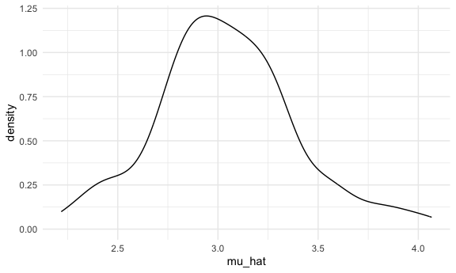
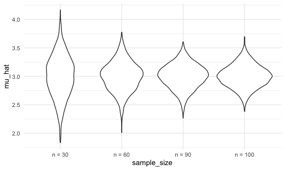
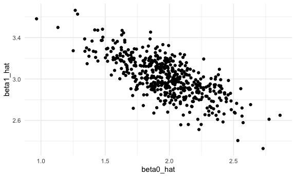
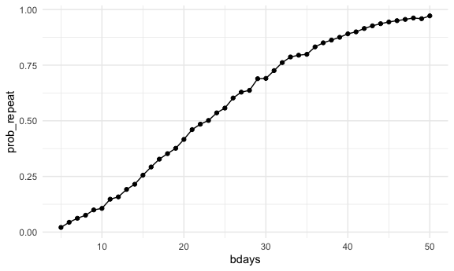

simulation
================
Nicole Criscuolo
2025-10-30

We can simulate by running our function.

``` r
sim_mean_sd(n_subj = 400)
```

    ## # A tibble: 1 × 2
    ##   mu_hat sigma_hat
    ##    <dbl>     <dbl>
    ## 1   3.14      1.95

Can I “verify” central limit theorem?

First with a `for` loop. (run this function 100 times)

``` r
output = vector("list", length = 100)

for (i in 1:100) {
  
  output[[i]] = sim_mean_sd(30)
  
}

output |> 
  bind_rows() |> 
  ggplot(aes(x = mu_hat)) +
  geom_density()
```



Try to repeat with a map statement.

``` r
sim_results_df =
  expand_grid(
    iter = 1:1000,
    sample_size = c(30, 60, 90, 100)
    ) |> 
  mutate(
    results = map(sample_size, sim_mean_sd)
    ) |> 
  unnest(results)
```

Let’s look at this

``` r
sim_results_df |> 
  mutate(
    sample_size = str_c("n = ", sample_size),
    sample_size = fct_inorder(sample_size)
  ) |> 
  ggplot(aes(x = sample_size, y = mu_hat)) +
  geom_violin()
```



``` r
sim_results_df |> 
  group_by(sample_size) |> 
  summarize(
    emp_mean = mean(mu_hat),
    emp_se = sd (mu_hat)
  )
```

    ## # A tibble: 4 × 3
    ##   sample_size emp_mean emp_se
    ##         <dbl>    <dbl>  <dbl>
    ## 1          30     3.00  0.368
    ## 2          60     3.00  0.258
    ## 3          90     3.00  0.212
    ## 4         100     3.00  0.197

## Simple linear regression

``` r
sim_df =
  tibble(
    x = rnorm(30, mean = 1, sd = 1),
    y = 2 + 3 * x + rnorm(30, 0, 1)
  )

slr_fit = lm(y ~ x, data = sim_df)

coef(slr_fit)
```

    ## (Intercept)           x 
    ##    1.508433    3.325248

Turn this into a function.

``` r
sim_regression = function (n_subj, beta_0 = 2, beta_1 = 3) {
  
  sim_df =
  tibble(
    x = rnorm(n_subj, mean = 1, sd = 1),
    y = beta_0 + beta_1 * x + rnorm(n_subj, 0, 1)
  )

slr_fit = lm(y ~ x, data = sim_df)

tibble(
  beta0_hat = coef(slr_fit)[[1]],
  beta1_hat = coef(slr_fit)[[2]]
  ) 

}
```

``` r
sim_regression(n_subj = 30)
```

    ## # A tibble: 1 × 2
    ##   beta0_hat beta1_hat
    ##       <dbl>     <dbl>
    ## 1      2.55      2.70

``` r
output = vector("list", length = 500)

for (i in 1:500) {
  
  output[[i]] = sim_regression(n_subj = 30)
  
}

output |> 
  bind_rows()
```

    ## # A tibble: 500 × 2
    ##    beta0_hat beta1_hat
    ##        <dbl>     <dbl>
    ##  1      2.06      2.94
    ##  2      1.91      2.92
    ##  3      2.56      2.80
    ##  4      2.17      2.80
    ##  5      1.89      3.09
    ##  6      1.74      3.19
    ##  7      1.98      3.06
    ##  8      2.21      3.08
    ##  9      1.68      3.10
    ## 10      1.76      3.01
    ## # ℹ 490 more rows

``` r
slr_sim_results_df = 
  expand_grid(
    sample_size = 30,
    iter = 1:500
  ) |> 
  mutate(
    results = map(sample_size, sim_regression)
    ) |> 
  unnest(results)

slr_sim_results_df |> 
  ggplot(aes(x = beta0_hat, y = beta1_hat)) +
  geom_point()
```



## One more example (birthday problem)

``` r
birthdays = sample(1:365, 5, replace = TRUE) # sample of 5 picking from 365 possible choices with replacement

unique(c(1, 2, 3, 4, 5, 1, 1, 3)) # showing what unique() does
```

    ## [1] 1 2 3 4 5

``` r
repeated_bday = length(unique(birthdays)) < 5
repeated_bday
```

    ## [1] FALSE

Put this in a function.

``` r
bday_sim = function(n_room) {
  
  birthdays = sample(1:365, n_room, replace = TRUE)
  
  repeated_bday = length(unique(birthdays)) < n_room
  
  repeated_bday
  
}
```

``` r
bday_sim(20) # want to run this a bunch of times for different n_room
```

    ## [1] TRUE

``` r
bday_sim_results =
  expand_grid(
    bdays = 5:50,
    iter = 1:2500
  ) |> 
  mutate(
    result = map_lgl(bdays, bday_sim)
  ) |> 
  group_by(
    bdays
    ) |> 
  summarize(
    prob_repeat = mean(result)
    )
```

``` r
bday_sim_results |> 
  ggplot(aes(x = bdays, y = prob_repeat)) +
  geom_point() +
  geom_line()
```


